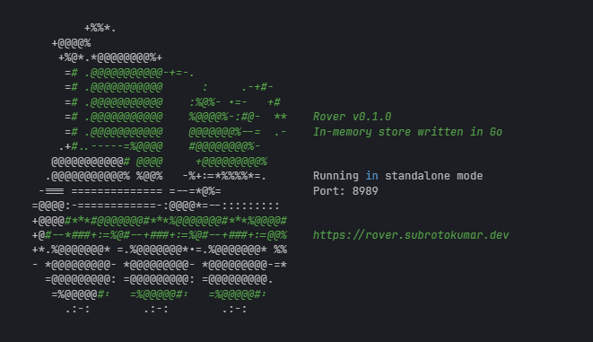

<div align="center">
  

  # Rover

  In-memory key-value store inspired by Redis, rewritten from the ground up in Go.

  [](https://golang.org)
  [](LICENSE)
  [](https://github.com/subrotokumar/rover/stargazers)

</div>

## 🚀 Introduction

**Rover** is a lightning-fast, in-memory key-value store that combines the simplicity of Redis with the power of Go. Built from scratch, Rover leverages Go's robust concurrency features and performance optimizations to deliver a high-performance data storage solution.



## ✨ Features

- 🚄 **Blazing Fast**: In-memory storage for rapid data access
- 🔄 **Concurrent**: Utilizes Go's goroutines for efficient multi-client handling
- 🔌 **Standalone Mode**: Run Rover as a standalone server
- 🔐 **Secure**: (TODO: Add security features)
- 🫙 **Managing Databases**: Out of the box, a Rover instance supports 16 logical databases
- 🎨 **Beautiful CLI**: Eye-catching command-line interface with color support
- 👾 **Robust Command Support**:
  - *Data Commands*: __ping__, __get__, __set__ (with options: NX/XX, EX/PX, GET), __del__, __exists__, __append__
  - *Counter Commands*: __incr__, __incrby__, __decr__, __decrby__
  - *Utility Commands*: __flushall__ (clear all keys), __strlen__ (check string length)

## 🛠 Installation

```bash
docker run -d --name rover -p 8989:8989 subrotokumar/rover
```

## 🌟 Why Rover?
- **Go Power**: Written in Go for excellent performance and concurrency
- **Redis Compatibility**: Familiar Redis-like commands and interface
- **Lightweight**: Minimal dependencies for a small footprint
- **Extensible**: Easy to add new features and commands

## 📜 License
Rover is released under the Apache License Version 2.0 License. See the [LICENSE](./LICENSE) file for details.

## 🙏 Acknowledgements
- Inspired by Redis 
- Built with love using Go  


<div align="center">
  Made with ❤️ by <a href="https://github.com/subrotokumar">Subroto Kumar</a>
</div>