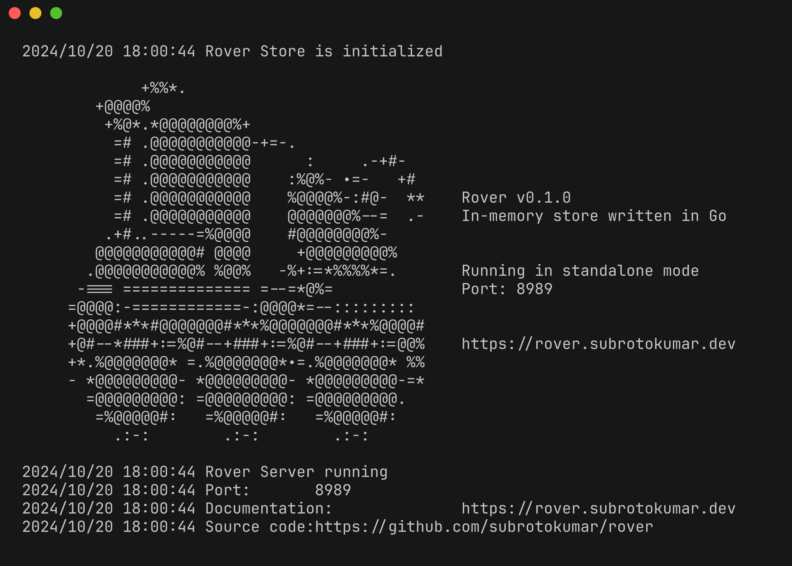

    <table style="width:100%; border-collapse: collapse;">
        <tr>
            <td style="width: 20%; text-align: center;">
                
            </td>
            <td style="width:80%;">
                <h1>Rover</h1>
                <strong>Rover</strong> is an in-memory key-value store inspired by Redis, but rewritten from the ground up in Go. It aims to provide the simplicity and speed of Redis while leveraging Go's powerful concurrency features and performance optimizations.
                  
            </td>
        </tr>
    </table>

